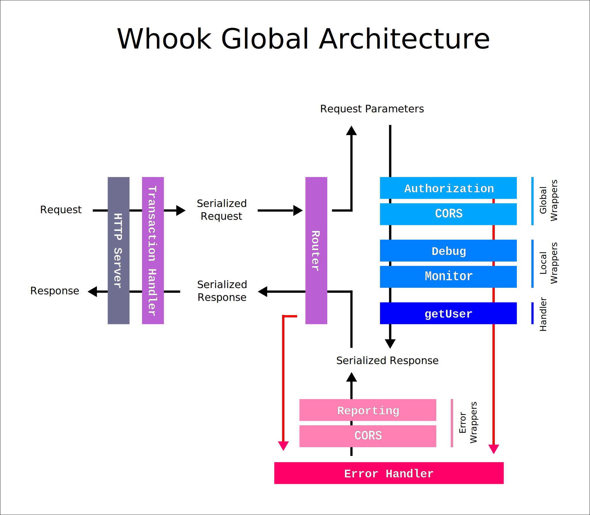

[//]: # ( )
[//]: # (This file is automatically generated by a `metapak`)
[//]: # (module. Do not change it  except between the)
[//]: # (`content:start/end` flags, your changes would)
[//]: # (be overridden.)
[//]: # ( )
# whook
> Build strong and efficient REST web services.

[](https://github.com/nfroidure/whook/blob/master/LICENSE)
[](https://coveralls.io/github/nfroidure/whook?branch=master)


[//]: # (::contents:start)

Why write code when you have an OpenAPI 3 definition?

## Summary

Whook eats your documentation and provide you with a
performant router that take care of running the right
code for the right operation.

By using the [OpenAPI](https://www.openapis.org/) standard and
the dependency injection pattern, Whook provides a convenient,
highly modular and easily testable back end framework.

## Quickstart

To start a new Whook project:

```sh
# Initialize the project
npm init @whook;
cd my_project_name;

# Check install with a dry run of the server
DRY_RUN=1 npm run start

# Run tests
npm t

# Build the project
npm run build

# Create a new handler/service/provider
npx whook create
```

## Why use Whook?

- robust: types, functional programming
- highly modular, extendable and reusable
- fully integrated and production ready
- easy to deploy, anywhere (serverless, docker, microservices): enter the anylith era
- easy to test: TDD, E2E tests made easy
- feature complete for most API use cases
- simplify your life but embrace projects complexity

## Usage

A tutorial is still to be written, expect it to come very soon.
The above [quickstart command](#quickstart) is a good starting point.

That said you can check the following "How to" PRs:

- [add GraphQL](https://github.com/nfroidure/whook/pull/62)
- [deploy on AWS Lambda](https://github.com/nfroidure/whook/pull/54)
- [deploy with GCP Cloud Functions](https://github.com/nfroidure/whook/pull/66)

Also, the [`packages/` folder](./packages) contains a lot of easy to
setup modules with well detailed readmes and setup instructions.

Finally, search for Whook's package easily with the
[NPM's Whook tag](https://www.npmjs.com/search?q=keywords:whook).

If you have any question or issue using Whook, post your help request
to stack overflow with the
[Whook tag](https://stackoverflow.com/questions/ask?tags=whook).
Questions with this tag will be regularly checked by Whook's authors.

Finally, if you encounter any bug (unexpecter error, feature requests,
OpenAPI specification violation), please fill an issue!

## Principles

[Check this deck](https://slides.com/nfroidure/introducing-whook)
for a complete introduction to Whook's principles!

### Global overview

This projects aims to make creating well documented and highly
customizable REST APIs a breeze. It is the final outcome of my experience
[building REST APIs with NodeJS](https://insertafter.com/en/blog/http_rest_apis_with_nodejs.html).

By relying on the [OpenAPI format](https://www.openapis.org/)
to declare a new endpoint, this project forces documentation before code.
It also is highly customizable since based on the dependency injection
with inversion of control pattern allowing you to override or wrap its main
constituents.



The Whook route handling flow is very simple.

First, we have a HTTPServer that handles requests an serve responses
(the `httpServer` service).

Then, the `httpTransaction` transform the NodeJS requests into raw
serializable ones (raw objects with no methods nor internal states).

Then the router (`httpRouter`) deal with that request to test which
handler need to be run by comparing the method/path couple with the
OpenAPI operations declarations.

Once found, it simply runs the right handler with the OpenAPI
parameters value filled from the serializable request. The handler
simply have to return a serializable response object in turn.

If any error occurs within this process, than the `errorHandler`
is responsible for providing the now lacking response object
based on the error it catches.

And that's it, you have your REST API. We have
[no middleware](http://insertafter.com/en/blog/no_more_middlewares.html)
concept here. Instead, every handler is a simple function taking an object
and returning another one. It makes those objects very easily composable
(in a functional programming sense).

You may add global wrappers to change every handlers input/output on the
fly or add a local wrapper specifically to one of a few handlers.

### Core concepts

Whook work by adding ingredients to you API:

- **configuration**: Whook look ups for `config/{NODE_ENV}/config.js` files.
  It creates constants you can inject in your handlers and services.
- **API**: It defines the various endpoint of you API and how to map these
  to handlers thanks to the well known OpenAPI format (formerly Swagger),
- **handlers**: the code that implement the API endpoints,
- **services**: various services that deal with side effects,
- **wrappers**: higher order functions you can apply to handlers (CORS
  authentication...).

You can see a lot of those concepts implemented in the
[Whook example](./packages/whook-example) folder.

Whook's DI system relies on the
[Knifecyle](https://github.com/nfroidure/knifecycle) module.
It is great for adding or easily override/wrap a lot of its core
component and brings instrumentation and testability to your code
bases.

## Contributing

Contributors are very welcome to help pushing Whook forward!

Clone this project's repository and run:

```sh
npm it
```

The repository is based on LernaJS that allows to host several NPM
packages in a single repository. That said, to keep it simple
it only proxies the packages commands.

Install those [VSCode extensions](https://insertafter.com/en/blog/my_vscode_configuration.html)
to get a smooth developer experience.

## Publishing

```sh
NODE_ENV=cli npm run lerna  -- publish
```


[//]: # (::contents:end)

# Authors
- [Nicolas Froidure](http://insertafter.com/en/index.html)

# License
[MIT](https://github.com/nfroidure/whook/blob/master/LICENSE)
