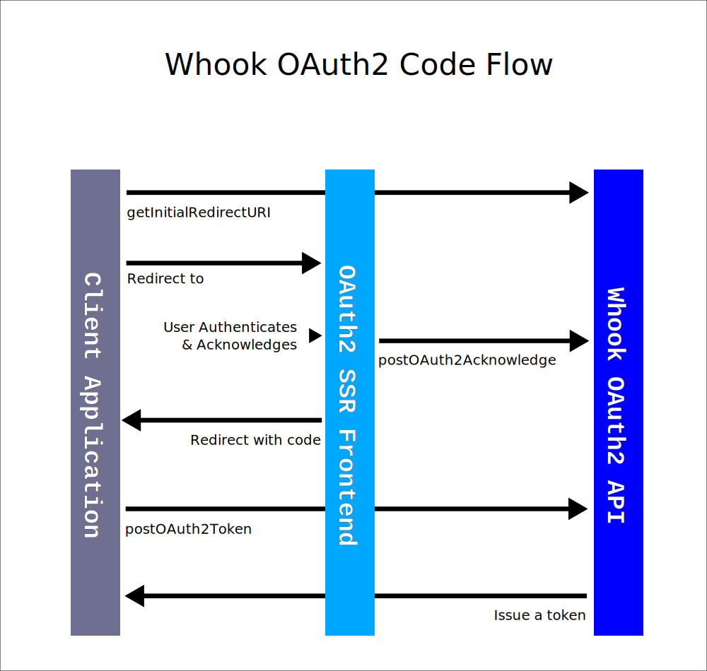

[//]: # ( )
[//]: # (This file is automatically generated by a `metapak`)
[//]: # (module. Do not change it  except between the)
[//]: # (`content:start/end` flags, your changes would)
[//]: # (be overridden.)
[//]: # ( )
# @whook/oauth2
> OAuth2 implementation for Whook servers

[](https://github.com/nfroidure/whook/blob/main/packages/whook-oauth2/LICENSE)


[//]: # (::contents:start)

This module is aimed to allow you to easily bring OAuth2 to your
[Whook](https://github.com/nfroidure/whook) server. It must be used with a
server side rendered frontend that brings the UI that allows users to
authenticate and allow client applications to act on behalf of them.



The module provides:

- 2 OAuth2 routes definitions implementing the 2 OAuth2 standard endpoints
  (`getOAuth2authorize`, `postOAuth2Tokentoken`) to be used by OAuth2 client
  applications,
- 4 authentication endpoints to be used by the authorization server directly to
  authenticate users (`postAuthLogin`, `postAuthRefresh`, `postAuthLogout`) and
  acknowledge the client requests (`postOAuth2Acknowledge`),
- 5 OAuth2 services implementing the standard grant types. You can create your
  own granter services to create additional grant types.

This module requires you to implement some services it relies on:

- `oAuth2AccessToken` that generates and checks the `access_token` and the
  `oAuth2RefreshToken` for the `refresh_token`, both have the same interface,
- `checkApplication` service that is supposed to check whether an application
  can be used or not for a given grant type, a given scope and redirect URI,
- `oAuth2PasswordService` aimed to check the `password` grant type with your own
  logic (if you use it),
- `oAuth2ClientCredentialsService` aimed to check the `client_credential` grant
  type with your own logic (if you use it),
- `OAuth2CodeService` aimed to check the `code` grant type with your own logic
  (if you use it).

## Quick setup

Install the module in your project:

```sh
npm i @whook/oauth2
```

Declare the plugin into your `src/index.ts` file:

```diff
  // (...)

  // Setup your own whook plugins or avoid whook defaults by leaving it empty
  $.register(
    constant('WHOOK_PLUGINS', [
      ...WHOOK_DEFAULT_PLUGINS,
+      '@whook/oauth2',
      '@whook/cors',
    ]),
  );
-  $.register(constant('WHOOK_PLUGINS', ['@whook/whook']));

  // (...)
```

Declare this module types in your `src/whook.d.ts` type definitions:

```diff
+import {
+  type OAuth2Config,
+} from '@whook/oauth2';

// ...

declare module 'application-services' {

  // (...)

  export interface AppConfig
-    extends WhookBaseConfigs {}
+    extends WhookBaseConfigs,
+      AuthCookiesConfig,
+      OAuth2Config {}

  // ...

}
```

Add the OAuth2 configuration to your config files:

```diff
// ...
+ import {
+   OAUTH2_ERRORS_DESCRIPTORS,
+   OAuth2Config,
+ } from '@whook/oauth2';
import { type AppConfig } from 'application-services';

// ...

const CONFIG: AppConfig = {
  // ...
+   OAUTH2: {
+     // The SSR frontend
+     authenticateURL: 'https://auth.example.com',
+   }
-   ERRORS_DESCRIPTORS: DEFAULT_ERRORS_DESCRIPTORS,
+   ERRORS_DESCRIPTORS: {
+     ...DEFAULT_ERRORS_DESCRIPTORS,
+     ...OAUTH2_ERRORS_DESCRIPTORS,
+   },
  // ...
};

export default CONFIG;
```

## Using your own grant types

The `oAuth2Granters` service gather the various granters services you can use in
your application but you can write your own that uses a subset or a superset of
these granters.

Here, for example a handler that implement a verify token mechanism in order to
validate a user subscription:

```ts
import { autoService } from 'knifecycle';
import { noop } from '@whook/whook';
import { type WhookAuthenticationData } from '@whook/authorization';
import { YError } from 'yerror';
import { type LogService } from 'common-services';
import {
  type OAuth2GranterService,
  type CheckApplicationService,
} from '@whook/oauth2';
import { type JWTService } from 'jwt-service';
import { type PGService } from 'postgresql-service';

export type OAuth2VerifyTokenGranterDependencies = {
  checkApplication: CheckApplicationService;
  jwtToken: JWTService<WhookAuthenticationData>;
  pg: Pick<PGService, 'query'>;
  log?: LogService;
};
export type OAuth2VerifyTokenGranterParameters = {
  verifyToken: string;
};
export type OAuth2VerifyTokenGranterService = OAuth2GranterService<
  unknown,
  unknown,
  OAuth2VerifyTokenGranterParameters,
  WhookAuthenticationData
>;

export default autoService(initOAuth2VerifyTokenGranter);

const USER_VERIFY_QUERY = `
UPDATE users
SET roles = ARRAY['user'::role]
WHERE id = $$userId
`;

async function initOAuth2VerifyTokenGranter({
  checkApplication,
  jwtToken,
  pg,
  log = noop,
}: OAuth2VerifyTokenGranterDependencies): Promise<OAuth2VerifyTokenGranterService> {
  const authenticateWithVerifyToken: OAuth2VerifyTokenGranterService['authenticator']['authenticate'] =
    async ({ verifyToken }, authenticationData) => {
      try {
        // The client must be authenticated
        if (!authenticationData) {
          throw new YError('E_UNAUTHORIZED');
        }

        const newAuthenticationData = await jwtToken.verify(verifyToken);

        await checkApplication({
          applicationId: authenticationData.applicationId,
          type: 'verify',
          scope: newAuthenticationData.scope,
        });

        const result = await pg.query(USER_VERIFY_QUERY, {
          userId: newAuthenticationData.userId,
        });

        if (result.rowCount === 0) {
          throw new YError('E_ALREADY_VERIFIED', authenticationData.userId);
        }

        return newAuthenticationData;
      } catch (err) {
        if (err.code === 'E_BAD_TOKEN') {
          throw YError.wrap(err as Error, 'E_BAD_REFRESH_TOKEN');
        }
        throw err;
      }
    };

  log('debug', '👫 - OAuth2VerifyTokenGranter Service Initialized!');

  return {
    type: 'verify',
    authenticator: {
      grantType: 'verify_token',
      authenticate: authenticateWithVerifyToken,
    },
  };
}
```

## Additional routes/helpers

For internal use, you may prefer use cookies based auth routes like
`postLogin`, `postLogout` and `postRefresh`.

To do so, configure the `ROOT_AUTHENTICATION_DATA` and `COOKIES` configurations:

```diff
// src/production/config.ts
+  COOKIES: {
+    domain: 'example.org',
+  },
+  ROOT_AUTHENTICATION_DATA: {
+    applicationId: 'abbacaca-abba-caca-caca-abbacacacaca',
+    scope: 'user,admin',
+  },
```

Than import the `postLogin`, `postLogout` and `postRefresh` routes like so:

```ts
// src/routes/postRefresh.ts
import {
  initPostAuthRefresh,
  postAuthRefreshDefinition,
  authCookieHeaderParameter,
} from '@whook/oauth2';
import { type WhookRouteDefinition } from '@whook/whook';

export { authCookieHeaderParameter };

export const definition: WhookRouteDefinition = {
  ...postAuthRefreshDefinition,
  operation: {
    ...postAuthRefreshDefinition.operation,
    'x-whook': {
      disabled: false,
    },
  },
};

export default initPostAuthRefresh;
```

Additionnaly, you could create any handler in the `/auth` path in order to
receive the auth cookies. For example, you may want to serve user profiles
there.

## Customizing routes

The endpoints definitions are designed to support the standard OAuth2
definitions but can be easily overridden.

You will also have to protect the `postOAuth2Acknowledge` with your own security
mechanism:

```ts
import {
  initPostOAuth2Acknowledge,
  postOAuth2AcknowledgeDefinition,
} from '@whook/oauth2';
import { type OpenAPI } from 'ya-open-api-types';
import { type WhookRouteDefinition } from '@whook/whook';

export default initPostOAuth2Acknowledge;

export const definition: WhookRouteDefinition = {
  ...postOAuth2AcknowledgeDefinition,
  operation: {
    ...postOAuth2AcknowledgeDefinition.operation,
    // Complete the definition to protect the endpoint
    security: [
      {
        bearerAuth: ['user'],
      },
    ],
    // Optionally you can rewrite the endpoint definition
    // to add more custom parameters to your endpoint
    requestBody: {
      required: true,
      content: {
        'application/json': {
          schema: {
            ...postOAuth2AcknowledgeDefinition.operation.requestBodyt.content[
              'application/json'
            ].schema,
            required: [
              'userId',
              ...postOAuth2AcknowledgeDefinition.operation.requestBody.content[
                'application/json'
              ].schema.required,
            ],
            properties: {
              ...postOAuth2AcknowledgeDefinition.operation.requestBody.content[
                'application/json'
              ].schema.properties,
              userId: {
                type: 'string',
              },
            },
          },
        },
      },
    },
  },
};
```

You will probably need to also protect the `postOAuth2Token` endpoint with your
own security mecanism:

```ts
// In a `src/routes/postOAuth2Token.ts` fileimport {
  initPostOAuth2Token,
  postOAuth2TokenDefinition,
  postOAuth2TokenAuthorizationCodeTokenRequestBodySchema,
  postOAuth2TokenPasswordTokenRequestBodySchema,
  postOAuth2TokenClientCredentialsTokenRequestBodySchema,
  postOAuth2TokenRefreshTokenRequestBodySchema,
  postOAuth2TokenTokenBodySchema,
} from '@whook/oauth2';
import { type WhookRouteDefinition } from '@whook/whook';

export default initPostOAuth2Token;

export const definition: WhookRouteDefinition = {
  ...postOAuth2TokenDefinition,
  operation: {
    ...postOAuth2TokenDefinition.operation,
    security: [
      {
        basicAuth: ['admin'],
      },
    ],
  },
};

export {
  postOAuth2TokenAuthorizationCodeTokenRequestBodySchema,
  postOAuth2TokenPasswordTokenRequestBodySchema,
  postOAuth2TokenClientCredentialsTokenRequestBodySchema,
  postOAuth2TokenRefreshTokenRequestBodySchema,
  postOAuth2TokenTokenBodySchema,
};
```

Or you may want to reduce the OAuth2 grant types supported:

```ts
// In a `src/routes/getOAuth2Authorize.ts` file
import {
  initGetOAuth2Authorize,
  getOAuth2AuthorizeDefinition as definition,
  getOAuth2AuthorizeResponseTypeParameter as baseResponseTypeParameter,
  getOAuth2AuthorizeClientIdParameter as clientIdParameter,
  getOAuth2AuthorizeRedirectURIParameter as redirectURIParameter,
  getOAuth2AuthorizeScopeParameter as scopeParameter,
  getOAuth2AuthorizeStateParameter as stateParameter,
} from '@whook/oauth2';

export default initGetOAuth2Authorize;

export {
  definition,
  clientIdParameter,
  redirectURIParameter,
  scopeParameter,
  stateParameter,
};

export const responseTypeParameter = {
  ...baseResponseTypeParameter,
  parameter: {
    ...baseResponseTypeParameter.parameter,
    schema: {
      ...baseResponseTypeParameter.parameter.schema,
      enum: ['code'], // Allow only the 'code' grant type
    },
  },
};
```

[//]: # (::contents:end)

# API

# Authors
- [Nicolas Froidure](http://insertafter.com/en/index.html)

# License
[MIT](https://github.com/nfroidure/whook/blob/main/packages/whook-oauth2/LICENSE)
