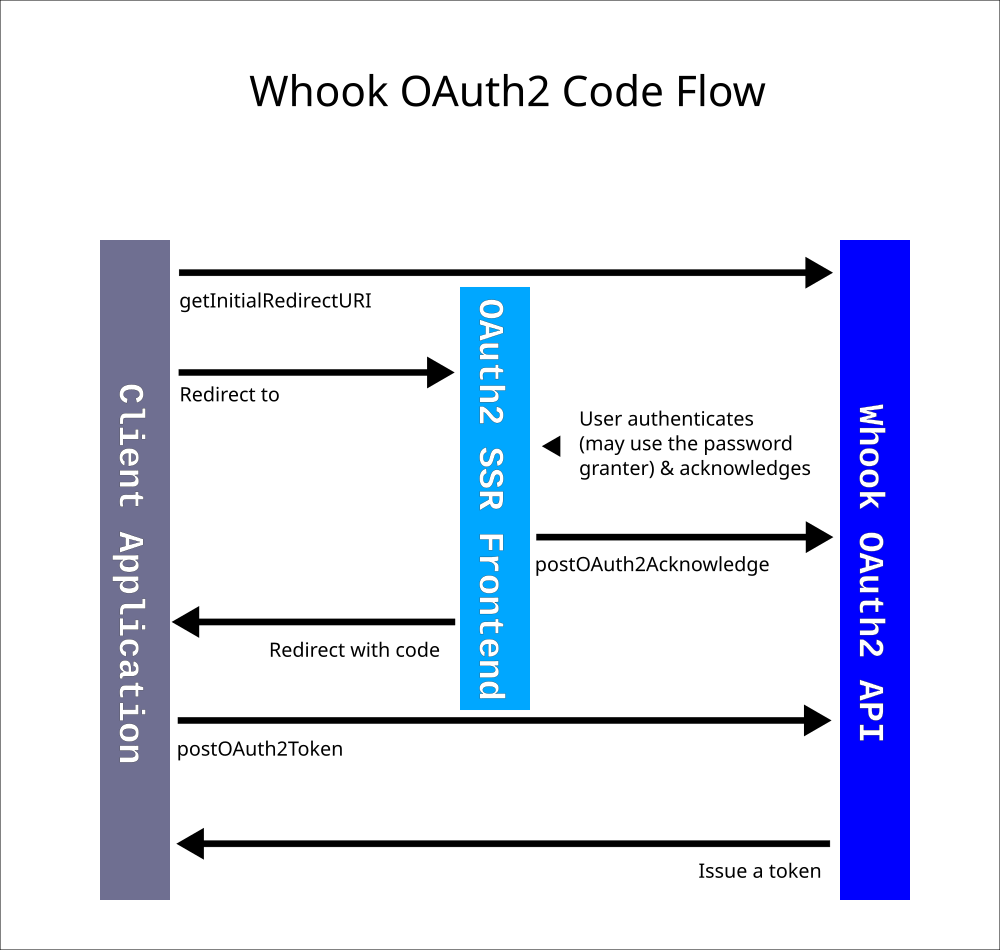

[//]: # ( )
[//]: # (This file is automatically generated by a `metapak`)
[//]: # (module. Do not change it  except between the)
[//]: # (`content:start/end` flags, your changes would)
[//]: # (be overridden.)
[//]: # ( )
# @whook/oauth2
> OAuth2 implementation for Whook servers

[](https://github.com/nfroidure/whook/blob/main/packages/whook-oauth2/LICENSE)


[//]: # (::contents:start)

This module is aimed to allow you to easily bring OAuth2 to your
[Whook](https://github.com/nfroidure/whook) server. To use the implicit, code
and other user facing flows, it requires a server side rendered frontend that
brings the UI that allows users to authenticate and allow client applications to
act on behalf of them.



The module provides:

- 3 OAuth2 routes definitions implementing OAuth2 standard endpoints
  (`getOAuth2Authorize`, `postOAuth2Token`, `postOAuth2Revoke`) to be used by OAuth2 client
  applications,
- 4 authentication endpoints to be used by the authorization server directly to
  authenticate users (`postAuthLogin`, `postAuthRefresh`, `postAuthLogout`) and
  acknowledge the client requests (`postOAuth2Acknowledge`),
- 5 OAuth2 services implementing the standard grant types. You can create your
  own granter services to create additional grant types.

This module requires you to implement some services it relies on:

- `oAuth2AccessToken` that generates and checks the `access_token` and the
  `oAuth2RefreshToken` for the `refresh_token`, both have the same interface,
- `readClientGrants` service that returns the grants for a given client id,
- `oAuth2PasswordService` aimed to check the `password` grant type with your own
  logic (if you use it),
- `oAuth2ClientCredentialsService` aimed to check the `client_credential` grant
  type with your own logic (if you use it),
- `oAuth2AuthorizationCodeService` aimed to check the `code` grant type with
  your own logic (if you use it).

## Quick setup

Install the module in your project:

```sh
npm i @whook/oauth2
```

Declare the plugin into your `src/index.ts` file:

```diff
  // (...)

  // Setup your own whook plugins or avoid whook defaults by leaving it empty
  $.register(
    constant('WHOOK_PLUGINS', [
      ...WHOOK_DEFAULT_PLUGINS,
+      '@whook/oauth2',
      '@whook/cors',
    ]),
  );
-  $.register(constant('WHOOK_PLUGINS', ['@whook/whook']));

  // (...)
```

Declare this module types in your `src/whook.d.ts` type definitions:

```diff
+import {
+  type WhookOAuth2Config,
+} from '@whook/oauth2';

// ...

declare module 'application-services' {

  // (...)

  export interface AppConfig
-    extends WhookBaseConfigs {}
+    extends WhookBaseConfigs,
+      WhookOAuth2Config {}

  // ...

}
```

Add the OAuth2 configuration to your config files:

```diff
// ...
+ import {
+   OAUTH2_ERRORS_DESCRIPTORS,
+   WhookOAuth2Config,
+ } from '@whook/oauth2';
import { type AppConfig } from 'application-services';

// ...

const CONFIG: AppConfig = {
  // ...
+   OAUTH2: {
+     // The SSR frontend
+     authenticateURL: 'https://auth.example.com',
+   }
-   ERRORS_DESCRIPTORS: DEFAULT_ERRORS_DESCRIPTORS,
+   ERRORS_DESCRIPTORS: {
+     ...DEFAULT_ERRORS_DESCRIPTORS,
+     ...OAUTH2_ERRORS_DESCRIPTORS,
+   },
  // ...
};

export default CONFIG;
```

## Using your own grant types

The `oAuth2Granters` service gather the various granters services you can use in
your application but you can write your own that uses a subset or a superset of
these granters.

Here, for example a handler that implement a verify token mechanism in order to
validate a user subscription:

```ts
import { autoService, location } from 'knifecycle';
import { noop } from '@whook/whook';
import { type WhookAuthenticationData } from '@whook/authorization';
import { YError, hasYErrorCode } from 'yerror';
import { type LogService } from 'common-services';
import {
  type WhookOAuth2ReadClientGrantsService,
  type WhookOAuth2GranterDefinitions,
  type WhookOAuth2GranterService,
  type WhookOAuth2Options,
} from '@whook/oauth2';
import { type JWTService } from 'jwt-service';
import { type PGService } from 'postgresql-service';
import sql from 'pgsqwell';

const VERIFY_USER_GRANTER_TYPE = 'verify_user';

export type OAuth2VerifyTokenGranterDependencies = {
  OAUTH2: WhookOAuth2Options;
  readClientGrants: WhookOAuth2ReadClientGrantsService;
  jwtToken: JWTService<WhookAuthenticationData>;
  pg: Pick<PGService, 'query'>;
  log?: LogService;
};

export interface OAuth2VerifyTokenGranterDefinitions extends WhookOAuth2GranterDefinitions {
  authenticateParameters: {
    verifyToken: string;
  };
}
export type OAuth2VerifyTokenGranterService =
  WhookOAuth2GranterService<OAuth2VerifyTokenGranterDefinitions>;

async function initOAuth2VerifyTokenGranter({
  readClientGrants,
  jwtToken,
  pg,
  log = noop,
}: OAuth2VerifyTokenGranterDependencies): Promise<OAuth2VerifyTokenGranterService> {
  const authenticateWithVerifyToken: OAuth2VerifyTokenGranterService['authenticate'] =
    async ({ verifyToken }, optionalAuthenticationData) => {
      try {
        const tokenAuthenticationData = await jwtToken.verify(verifyToken);

        const grants = await readClientGrants(tokenAuthenticationData.clientId);

        if (!grants.isPublicClient) {
          if (!optionalAuthenticationData) {
            throw new YError('E_UNAUTHORIZED');
          }
        }

        if (
          optionalAuthenticationData &&
          optionalAuthenticationData.clientId !==
            tokenAuthenticationData.clientId
        ) {
          throw new YError('E_OAUTH2_CLIENT_MISMATCH', [
            optionalAuthenticationData.clientId,
            tokenAuthenticationData.clientId,
          ]);
        }

        checkGrantType(grants.allowedGrantTypes, VERIFY_USER_GRANTER_TYPE);

        const result = await pg.query(sql`
UPDATE users
SET roles = ARRAY['user'::role]
WHERE id = ${tokenAuthenticationData.userId}
`);

        if (result.rowCount === 0) {
          throw new YError('E_ALREADY_VERIFIED', [
            tokenAuthenticationData.userId,
          ]);
        }

        return tokenAuthenticationData;
      } catch (err) {
        if (hasYErrorCode(err, 'E_BAD_TOKEN')) {
          throw YError.wrap(err, 'E_BAD_VERIFY_TOKEN');
        }
        throw err;
      }
    };

  log('debug', '👫 - OAuth2VerifyTokenGranter Service Initialized!');

  return {
    grantType: VERIFY_USER_GRANTER_TYPE,
    issuesRefreshToken: true,
    authenticate: authenticateWithVerifyToken,
  };
}

export default location(
  autoService(initOAuth2VerifyTokenGranter),
  import.meta.url,
);
```

## Additional routes/helpers

For internal use, you may prefer use cookies based auth routes like
`postAuthLogin`, `postAuthLogout` and `postAuthRefresh`.

To do so, configure the `COOKIES` configurations:

Declare this module types in your `src/whook.d.ts` type definitions:

```diff
// src/whook.d.ts
import {
  type WhookOAuth2Config,
+  type WhookAuthCookiesConfig,
} from '@whook/oauth2';

// ...

declare module 'application-services' {

  // (...)

  export interface AppConfig
    extends WhookBaseConfigs,
+      WhookAuthCookiesConfig,
       WhookOAuth2Config {}

  // ...

}
```

```diff
// src/production/config.ts
+  COOKIES: {
+    domain: 'example.org',
+  },
```

Then import the `postAuthLogin`, `postAuthLogout` and `postAuthRefresh` routes
like so:

```ts
// src/routes/postAuthRefresh.ts
import {
  initPostAuthRefresh,
  postAuthRefreshDefinition as definition,
  authCookieHeaderParameter,
} from '@whook/oauth2';

// You may override definition depending on your needs here
export { definition, authCookieHeaderParameter };

export default initPostAuthRefresh;
```

Additionally, you could create any handler in the `/auth` path in order to
receive the auth cookies. For example, you may want to serve user profiles
there.

## Customizing routes

The endpoints definitions are designed to support the standard OAuth2
definitions but can be easily overridden.

You will also have to protect the `postOAuth2Acknowledge` with your own security
mechanism:

```ts
import {
  initPostOAuth2Acknowledge,
  postOAuth2AcknowledgeDefinition,
} from '@whook/oauth2';
import { type OpenAPI } from 'ya-open-api-types';
import { type WhookRouteDefinition } from '@whook/whook';

export default initPostOAuth2Acknowledge;

export const definition: WhookRouteDefinition = {
  ...postOAuth2AcknowledgeDefinition,
  operation: {
    ...postOAuth2AcknowledgeDefinition.operation,
    // Complete the definition to protect the endpoint
    security: [
      {
        bearerAuth: ['user'],
      },
    ],
    // Optionally you can rewrite the endpoint definition
    // to add more custom parameters to your endpoint
    requestBody: {
      required: true,
      content: {
        'application/json': {
          schema: {
            ...postOAuth2AcknowledgeDefinition.operation.requestBody.content[
              'application/json'
            ].schema,
            required: [
              'userId',
              ...postOAuth2AcknowledgeDefinition.operation.requestBody.content[
                'application/json'
              ].schema.required,
            ],
            properties: {
              ...postOAuth2AcknowledgeDefinition.operation.requestBody.content[
                'application/json'
              ].schema.properties,
              userId: {
                type: 'string',
              },
            },
          },
        },
      },
    },
  },
};
```

You will probably need to also protect the `postOAuth2Token` endpoint with your
own security mechanism:

```ts
// In a `src/routes/postOAuth2Token.ts` file
import {
  initPostOAuth2Token,
  postOAuth2TokenDefinition,
  postOAuth2TokenTokenBodySchema,
  postOAuth2TokenAuthorizationCodeTokenRequestBodySchema,
  postOAuth2TokenClientCredentialsTokenRequestBodySchema,
  postOAuth2TokenCodeVerifierSchema,
  postOAuth2TokenPasswordTokenRequestBodySchema,
  postOAuth2TokenRefreshTokenRequestBodySchema,
} from '@whook/oauth2';
import {
  type WhookAPISchemaDefinition,
  type WhookRouteDefinition,
  refersTo,
} from '@whook/whook';

export const definition = {
  ...postOAuth2TokenDefinition,
  operation: {
    ...postOAuth2TokenDefinition.operation,
    security: [
      {
        basicAuth: ['oauth2'],
      },
    ],
  },
} as const satisfies WhookRouteDefinition;

export {
  postOAuth2TokenTokenBodySchema,
  postOAuth2TokenAuthorizationCodeTokenRequestBodySchema,
  postOAuth2TokenClientCredentialsTokenRequestBodySchema,
  postOAuth2TokenCodeVerifierSchema,
  postOAuth2TokenPasswordTokenRequestBodySchema,
  postOAuth2TokenRefreshTokenRequestBodySchema,
};

export default initPostOAuth2Token;
```

Or you may want to reduce the OAuth2 grant types supported:

```ts
// In a `src/routes/getOAuth2Authorize.ts` file
import {
  initGetOAuth2Authorize,
  getOAuth2AuthorizeDefinition as definition,
  getOAuth2AuthorizeClientIdParameter as clientIdParameter,
  getOAuth2AuthorizeCodeChallengeMethodParameter as codeChallengeMethodParameter,
  getOAuth2AuthorizeCodeChallengeMethodSchema as codeChallengeMethodSchema,
  getOAuth2AuthorizeCodeChallengeParameter as codeChallengeParameter,
  getOAuth2AuthorizeCodeChallengeSchema as codeChallengeSchema,
  getOAuth2AuthorizeRedirectURIParameter as redirectURIParameter,
  getOAuth2AuthorizeResponseTypeParameter as baseResponseTypeParameter,
  getOAuth2AuthorizeScopeParameter as scopeParameter,
  getOAuth2AuthorizeScopeSchema as scopeSchema,
  getOAuth2AuthorizeStateParameter as stateParameter,
} from '@whook/oauth2';

export const responseTypeParameter = {
  ...baseResponseTypeParameter,
  parameter: {
    ...baseResponseTypeParameter.parameter,
    schema: {
      ...baseResponseTypeParameter.parameter.schema,
      enum: ['code'], // Allow only the 'code' response type
    },
  },
};

export {
  definition,
  codeChallengeSchema,
  codeChallengeParameter,
  codeChallengeMethodSchema,
  codeChallengeMethodParameter,
  clientIdParameter,
  redirectURIParameter,
  scopeParameter,
  stateParameter,
  scopeSchema,
};

export default initGetOAuth2Authorize;
```

[//]: # (::contents:end)

# API

# Authors
- [Nicolas Froidure](http://insertafter.com/en/index.html)

# License
[MIT](https://github.com/nfroidure/whook/blob/main/packages/whook-oauth2/LICENSE)
